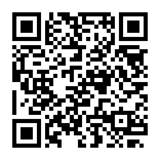
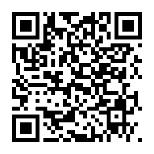

<div align="center">

# Help 1,000 Children Live Safely

**A community-funded effort supporting food, clean water, healthcare, shelter, clothing, and education.**

`1,000 children` &nbsp;•&nbsp; `$100.00 per child` &nbsp;•&nbsp; `$100,000.00 goal`

</div>

---

## Campaign progress

| Raised | Goal | Still needed | Children supported |
|---:|---:|---:|---:|
| **$0.00** | $100,000.00 | $100,000.00 | **0 / 1,000** |

```text
░░░░░░░░░░░░░░░░░░░░░░░░░░░░  0.00%
```

> **Updated 2026-07-14 05:42 UTC.** Only the combined donation total is published; donor identities and individual donation amounts remain private.

---

## Donate with cryptocurrency

<table align="center">
  <tr>
    <td align="center" width="50%">
      <h3>Bitcoin</h3>
      
      <br><br>
      <strong>Bitcoin Mainnet</strong>
      <br><br>
      <code>bc1qrzmpx6yfrmpkgulmpckluth6u0v8fdzzgde6mt</code>
      <br><br>
      <a href="bitcoin:bc1qrzmpx6yfrmpkgulmpckluth6u0v8fdzzgde6mt"><strong>Open in Bitcoin wallet</strong></a>
    </td>
    <td align="center" width="50%">
      <h3>Ethereum</h3>
      
      <br><br>
      <strong>Ethereum Mainnet only</strong>
      <br><br>
      <code>0x6602b6Ac96086C5296c8811EC0a9031D2e417E05</code>
      <br><br>
      <a href="ethereum:0x6602b6Ac96086C5296c8811EC0a9031D2e417E05@1"><strong>Open in Ethereum wallet</strong></a>
    </td>
  </tr>
</table>

> [!CAUTION]
> Verify the wallet address and network before sending. Cryptocurrency transactions are generally irreversible.

---

## What donations support

| Essential needs | Health and safety | Education and stability |
|---|---|---|
| Food and clean water | Medicine and healthcare | School supplies |
| Clothing and daily essentials | Safe shelter | Education costs |
| Emergency supplies | Transportation assistance | Ongoing project support |

---

## Transparency and privacy

Project updates may include aggregate funds received, funds spent, expense receipts, the number of children supported, and general progress reports.

To protect privacy, public reports do **not** include donor names, donor wallet addresses, or individual donation amounts.

---

## Organizer

**CIFCARE**

Contact: [contact@cifcare.com](mailto:contact@cifcare.com)

---

<div align="center">

### Cannot donate right now?

Sharing this page can still help it reach someone who can.

**Thank you for helping provide safety, health, food, and hope.**

</div>
