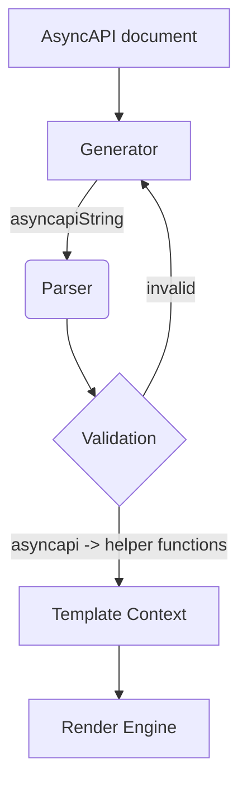

## Parser

The AsyncAPI Parser is a package used to parse and validate the [AsyncAPI documents](asyncapi-document.md) in your Node.js or browser application. These documents can be either in YAML or JSON format.

The Parser validates these documents using dedicated schema-supported plugins. 

Supported schemas:

- AsyncAPI schema (no plugin needed)
- OpenAPI schema
- JSON schema
- Avro schema
- RAML data-type schema

The Parser allows the template developer to easily access schemas provided in the above supported formats. This is because the JavaScript parser converts all of them into JSON schema.

If the document is valid, the Parser returns an `AsyncAPIDocument instance` with a set of helper functions that enable easier access to the contents of the AsyncAPI document. The parser provides dereferenced output. During the dereference process, the AsyncAPI parser substitutes a reference with a full definition. The dereferenced output is always in JSON format. The parser provides a message listing all errors if a document is invalid. The original AsyncAPI document is part of the [Template Context](template-context.md) as the generator also passes the original AsyncAPI document to the template context.	

The following AsyncAPI document example has two channels: `channelOne` and `channelTwo`. Each channel has one operation and a single message:

```yaml
asyncapi: '2.5.0'
info:
  title: Demo API
  version: '1.0.0'
channels:
  channelOne:
    publish:
      summary: This is the first sample channel
      operationId: onMessage
      message:
        name: FirstMessage
        payload:
            id:
              type: integer
              minimum: 0
              description: Id of the channel
            sentAt:
              type: string
              format: date-time
              description: Date and time when the message was sent.
  channelTwo:
    publish:
      summary: This is the second sample channel
      operationId: messageRead
      message:
        name: SecondMessage
        payload:
            id:
              type: integer
              minimum: 0
              description: Id of the channel
            sentAt:
              type: string
              format: date-time
              description: Date and time when the message was sent.
```
We can use helper functions provided by the Parser to operate on the above JSON file. For example, we can use the helper method `asyncAPIDocument.channelNames()`, which returns an array of all channel names currently present in the AsyncAPI document. Another example where you can use a helper function is to list out messages present in your JSON file. Instead of fetching a single message one at a time, you can use the function `asyncAPIDocument.allMessages()` that returns the map of all messages in your AsyncAPI document.

```js
  const channelNames = asyncAPIDocument.channelNames();
  const messages = asyncAPIDocument.allMessages();
```

> The Parser gives you access to a number of these [helper functions](https://github.com/asyncapi/parser-js/blob/master/API.md) that you can implement to access the contents of your AsyncAPI document. 

## AsyncAPI document validation process

1. **AsyncAPI document** is fed as an input to the Generator.
1. Generator sends the AsyncAPI document to the Parser as **asyncapiString**; the stringified version of the original AsyncAPI document.
1. The Parser uses additional plugins such as the OpenAPI, RAML, or Avro schemas to validate custom schemas of message payloads defined in the AsyncAPI document.
1. If the AsyncAPI document is invalid, it throws an error based on the encountered failure type. For example, if the AsyncAPI document is not a string nor a JavaScript object, the Parser throws an `invalid-document-type` error. 
   Similarly, you may encounter errors such as:
      - `invalid-json`
      - `invalid-yaml`
      - `impossible-to-convert-to-json`
1. If the document is valid, the Parser modifies the AsyncAPI document, returns a set of helper functions, and bundles them together into the **asyncapi** variable. These helper functions in the form of an **asyncapi** variable are passed to the **Template Context**.
1. The Template Context passes all of these values to the [**Render Engine**](react-render-engine.md) of your choice. Finally, the Render Engine generates whatever output you may have specified in your template. (i.e. code, documentation, diagrams, pdfs, applications, etc.)



> To learn more about the Parser and access all of its features, check out the AsyncAPI [Parser’s GitHub repository](https://github.com/asyncapi/parser-js).

