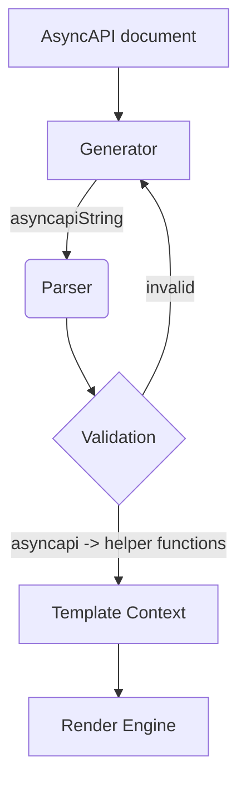

## Parser

The AsyncAPI Parser is a package used to parse and validate the [AsyncAPI documents](asyncapi-document.md) in your Node.js or browser application. These documents can be either in YAML or JSON format.

Parser validates these documents using dedicated schema-supported plugins. These supported schemas are:

- AsyncAPI schema (no plugin needed)
- OpenAPI schema
- JSON schema
- Avro schema
- RAML data-type schema

Parser allows the template developer to also easily access schemas provided in all of the above supported formats. This is because the JavaScript parser converts all of them into JSON schema.

If the document is valid, Parser returns `AsyncAPIDocument` instance with a set of helper functions that enable easier access to contents of AsyncAPI document. The parser provides dereferenced output. During the dereference process the AsyncAPI parser substitutes a reference with a full definition. The dereferenced output is always in the JSON format. If a document is invalid, the parser provides a message listing all errors. The original asyncAPI document is part of the [Template Context](template-context.md) as generator passes the original asyncAPI document to the template context as well.	

For example, the following asyncapi document has two channels–`channelOne` and `channelTwo`. Each channel has one operation and a single message:

```yaml
asyncapi: '2.5.0'
info:
  title: Demo API
  version: '1.0.0'
channels:
  name/channelOne:
    publish:
      summary: This is the first sample channel
      operationId: onMessage
      message:
        name: FirstMessage
        payload:
            id:
              type: integer
              minimum: 0
              description: Id of the channel
            sentAt:
              type: string
              format: date-time
              description: Date and time when the message was sent.
  name/channelTwo:
    publish:
      summary: This is the second sample channel
      operationId: messageRead
      message:
        name: SecondMessage
        payload:
            id:
              type: integer
              minimum: 0
              description: Id of the channel
            sentAt:
              type: string
              format: date-time
              description: Date and time when the message was sent.
```
We can use helper functions provided by parser to operate on the above JSON file. For example, we can use the helper method `asyncAPIDocument.channelNames()` which returns an array of all channel names currently present in the asyncAPI document. Another example where you can use a helper function is to list out messages present in your JSON file. Instead of fetching a single message one at a time, you can use the function `asyncAPIDocument.allMessages()` that returns the map of all messages present in your asyncAPI document.

```js
  const channelNames = asyncAPIDocument.channelNames();
  const messages = asyncAPIDocument.allMessages();
```

> Parser gives you access to a number of these [helper functions](https://github.com/asyncapi/parser-js/blob/master/API.md) that you can implement to access contents of your asyncAPI document. 

## AsyncAPI document validation process

1. **AsyncAPI document** is fed as an input to the Generator.
1. Generator sends asyncAPI document to the parser as **asyncapiString**. It is the stringified version of the original asyncAPI document.
1. Parser uses additional plugins such as the OpenAPI, RAML, or Avro schemas to validate custom schemas of message payloads defined in the AsyncAPI Document.
1. If the asyncAPI document is invalid, it throws an error based on the type of failure that was encountered. For example, if the AsyncAPI document is not a string nor a JS object, parser throws the `invalid-document-type` error. 
   Similarly, you may encounter errors such as:
      - `invalid-json`
      - `invalid-yaml`
      - `impossible-to-convert-to-json`
1. If the document is valid, it modifies the asyncAPI document and returns a set of helper functions and bundles them together into the **asyncapi** variable. These helper functions in the form asyncapi variable are passed to the **Template Context**.
1. Template context passes all of these values to the [**Render engine**](react-render-engine.md) of your choice. Finally, the render engine generates whatever output you may have specified in your template such as—code, documentation, diagrams, pdf, applications etc.



> To learn more about parser and access all of its features, you can check out the AsyncAPI [Parser’s github repository](https://github.com/asyncapi/parser-js).
