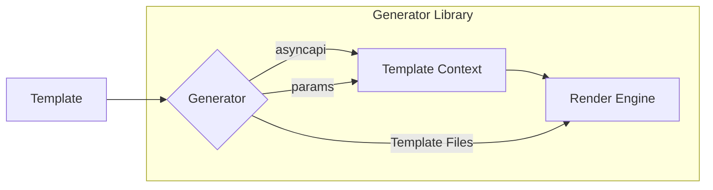

## Template

A template is a project that specifies the generation process output by using the AsyncAPI generator and an [AsyncAPI document](asyncapi-file.md). These files describe the generation results depending on the AsyncAPI document's content.

Examples outputs:

- Code
- Documentation
- Markdown diagrams
- Python and Java applications

A template is an independent Node.js project unrelated to the `generator` repository. AsyncAPI templates are managed, released, and published separately. You can also create templates and manage templates on your own.

The generator uses the official [Arborist](https://www.npmjs.com/package/@npmcli/arborist) NPM library. (This means templates do not have to be published to package managers to use them.) Arborist helps the generator fetch the template's source code and use it for the generation process. 

You can store template projects on a local drive or as a `git` repository during the development process. 

## Template generation process

1. Template is provided as input to the **Generator**.
2. **asyncapi** is the original AsyncAPI document injected into your template file by default.
3. **params** are the parameters you pass to the generator CLI. Later, you can also pass these **params** further to other components. 
4. The generator passes both the original **asyncapi**, the original AsyncAPI document, and the **params** to the **Template Context**.
5. Concurrently, the generator passes **Template files** to the **Render engine** as well. AsyncAPI uses two render engines — _react_ and _nunjucks_.
6. Once the Render Engine receives both the Template Files and the Template Context, it injects all the dynamic values into your react or nunjucks engine, based on the Template Files using the Template Context.
7. The render engine generates whatever output you may have specified in your template. (i.e. code, documentation, diagrams, pdfs, applications, etc.)

## Generator `templates` list

AsyncAPI has a list of available templates to enhance your generation process. Templates are stored as repositories on AsyncAPI's official GitHub profile.

<!-- templates list is validated with GitHub Actions do not remove list markers -->
<!-- TEMPLATES-LIST:START -->

Template Name | Description | Source code
---|---|---
`@asyncapi/nodejs-template` | Generates Node.js service that uses Hermes package | [Node.js template](https://github.com/asyncapi/nodejs-template)
`@asyncapi/nodejs-ws-template` | Generates Node.js service that supports WebSocket protocol only | [Node.js WebSocket template](https://github.com/asyncapi/nodejs-ws-template)
`@asyncapi/java-template` | Generates Java JMS application | [Java template](https://github.com/asyncapi/java-template)
`@asyncapi/java-spring-template` | Generates Java Spring service | [Java spring template](https://github.com/asyncapi/java-spring-template)
`@asyncapi/java-spring-cloud-stream-template` | Generates Java Spring Cloud Stream service | [Java spring cloud stream template](https://github.com/asyncapi/java-spring-cloud-stream-template)
`@asyncapi/python-paho-template` | Generates Python service that uses Paho library | [Python paho template](https://github.com/asyncapi/python-paho-template)
`@asyncapi/html-template` | Generates HTML documentation site | [HTML template](https://github.com/asyncapi/html-template)
`@asyncapi/markdown-template` | Generates documentation in Markdown file | [Markdown template](https://github.com/asyncapi/markdown-template)
`@asyncapi/ts-nats-template` | Generates TypeScript NATS client | [TypeScript/Node.js NATS template](https://github.com/asyncapi/ts-nats-template/)
`@asyncapi/go-watermill-template` | Generates Go client using Watermill | [GO watermill template](https://github.com/asyncapi/go-watermill-template)
`@asyncapi/dotnet-nats-template` | Generates .NET C# client using NATS | [.NET C# NATS template](https://github.com/asyncapi/dotnet-nats-template)

<!-- TEMPLATES-LIST:END -->

> Some of these templates are maintained by various third-party organizations. The README file usually contains this information and more, such as configuration options the user can pass to the template, usage, technical requirements, etc.

> Check out all our community [generator templates](https://github.com/search?q=topic%3Aasyncapi+topic%3Agenerator+topic%3Atemplate)

